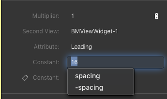

# Intro

Requires [CoreUI](https://github.com/ptc-iot-sharing/BMCoreUI) and allows the use of BMView and constraint-based layouts in Thingworx.

<!-- TOC depthfrom:2 orderedlist:false -->

- [What is View](#what-is-view)
- [Usage](#usage)
    - [Layout constraints basics](#layout-constraints-basics)
    - [Setting up layout constraints](#setting-up-layout-constraints)
    - [Responsive layouts](#responsive-layouts)
    - [Layout variables](#layout-variables)
- [Developing](#developing)
    - [Required software](#required-software)
    - [Proposed folder structure](#proposed-folder-structure)
    - [Developing](#developing)
    - [Building and publishing](#building-and-publishing)

<!-- /TOC -->

## What is View

The `BMView` widget completely changes the way layouts are built in Thingworx. By using View, it is possible to define layouts using constraints that specify relationships between the different elements on the page instead of using the static positioning and size options normally available in Thingworx. For example, it is possible to define the layout using rules (called layout constraints) such that a button is positioned 16 pixels to the right of a textbox. A key feature of View and View-based widgets is that they are able to expose an intrinsic content size which tells the layout system which size an element should be so that all its content fits. This makes it easier to adapt layouts to different languages.

Additionally, View features tools that make it possible to adapt the layout for various screen sizes or even change it completely.

## Usage

To begin using View to manage your Thingworx application layout, start by adding a **View** widget to the root of your mashup. Regardless of whether it is a responsive mashup or a static mashup, the newly added View widget will expand to fill all available area. Note that the View widget, in addition to being a layout manager, also plays the role of a container widget that can be used in place of the classic *Panel* widget. Then you can add any other widgets you need directly into that View widget. Note that for these widgets you won't have to set the *Left, Top, Width* or *Height* properties as they will be managed by the View widget.

After adding your widgets to the page, you can being configuring the layout. View includes a custom built layout editor that can be opened by selecting any View widget and selecting the **Edit Layout** context menu action, or using the **Configure** button in View's properties panel.


When the layout editor opens, it will contain the same view as the mashup builder. There is a canvas in the center with all of your widgets, but the panels around it change:
 * On the left hand side there is a sidebar containing the hierarchy of widgets which can be used to select widgets
 * At the top there is a toolbar containing options for the preview size, responsive design tools and constraint variables - these will be detailed below
 * On the right there is a panel containing the layout properties of the selected widget

### Layout constraints basics

As mentioned earlier, the View widget uses different rules to define the layout, called layout constraints. These are then used by the layout engine to compute a layout that satisfies all of the constaints affecting the widgets within athe mashup. Note that only widgets that are directly children of a View widget can have constraints defined for them. Using a different container such as *Panel* will cause View to treat the entire panel contents as a single widget.

A layout constraint is a mathematical equality or inequality between two layout attributes on a widget that takes the form of:
```
view1.attribute1 = multiplier * view2.attribute2 + constant
```
where the equals sign can be replaced with an inequality sign as needed.
Note that despite looking like an assignment statement, the constraint expression is a mathematical equation and the layout
system may choose to modify either side (or even both) of the equation to fulfill the constraint's requirements.

For example, a constraint that makes view1 be twice as wide as view2 would look like:
```
view.width = 2 * view2.width + 0
```

There are four types of layout constraints: vertical position, horizontal position, width and height. 
Each of them controls a specific aspect of a widget's layout. A widget must have constraints which clearly define all four of those
attributes for the layout system to be able to size it and position it correctly.
Additionally, constraints having an attribute of a type on the left hand side of the equation can only have an attribute of the same type on the right hand side.
In other words, for example, a widget's vertical positioning can only depend on the vertical positioning of another widget and not on its horizontal positioning or its size.
For widgets that have intrinsic sizes, the sizing constraints are optional as the intrinsic sizes of the widgets will be used by default as size constraint inequalities. Additionally, for widgets that specify two positioning constraints for two different attributes the associated size constraint becomes optional. For example, a widget that has a constraint for the *Top* attribute and one for the *Bottom* attribute doesn't also require a constraint for *Height*, although one can be set nevertheless.

The available attributes are:
 * Horizontal Position
    * Leading
    * CenterX
    * Trailing
    * Left
    * Right
 * Vertical Position
    * Top
    * CenterY
    * Bottom
 * Width
    * Width
 * Height
    * Height

### Setting up layout constraints

After adding your widgets to the mashup and opening the layout editor, you can begin creating layout constraints to define your layout. To set up a layout constraint, use the right mouse button and drag one widget over another. When you release the right mouse button a popup menu will appear with several options for creating constraints. When a constraint is created, it is immediately selected. The panel on the right will switch to show the properties of the newly added constraint and the `Constant` property will receive keyboard focus so that it can be edited immediately.

In the example below, constraints are set up for a label so that it is positioned 16 pixels to the left edge of its container and 16 pixels to the top edge of its container: 


Whenever you select a widget in the layout editor, the constraints that affect also appear on the screen. You can click on a constraint to select it. In addition, the properties panel for a widget will also display a list of constraints from where you can navigate to each constraint's options.

### Responsive layouts

After setting up your layout, it is possible to modify parts of it to fit different screen sizes. To enable responsive layout mode, use the dropdown in the toolbar at the top to select a different screen size on which to work. By default, the **All Size Classes** option is selected. When you select a different screen size, the preview will change to that size and the toolbar will turn blue to indicate that you are working on a screen size variation.

When a screen size is selected, whenever you create a new constraint, that constraint will only take effect for devices of that screen size or when the browser window matches the selected screen size. Additionally, you will notice that in this mode, whenever you select a widget or a constraint, certain properties will appear twice and have an extra icon next to their name. This indicates that the value of that property will only take effect for that screen size.

The example below shows the setting page for a constraint that has a different value for the **Constant** property on phones:


### Layout variables

View also supports *layout variables* that are numeric values that are referenced often in your layouts. For example, your designs might use a standard spacing of 16 between elements. You could manually set the value 16 for the various constraints you create for your layout but then it becomes difficult to change the layout if this standard size changes. It would also be a time consuming task if, for example, that size should be 8 on phones. Every constraint would have to be changed to introduce this variation on phones.

Layout variables can be used to simplify this development. In the example detailed above, a `"spacing"` layout variable could be created and used instead of the explicit size when creating constraints. Additionally, the layout variables themselves support variations for different screen sizes.

Because layout variables are supposed to be re-used throughout the entire app, across mashups, a system has been developed so that they only have to be defined once. To do that, a single mashup can be selected where these layout variables are defined and all other mashups can reference the layout variables defined in that mashup. Note that unless the mashup is set up as a layout variable provider or a reference to such a mashup is provided, layout variables will be disabled. It is also important to make sure that, at runtime, the mashup where layout variables are defined is loaded before any other mashup that uses them. One strategy to manage this could be to define the layout variables in the application master or launch screen.

To mark a mashup as a layout variable provider, select the root View widget and enable the **ExportsLayoutVariables** property. The layout editor for that mashup will then gain the ability to create and use layout variables.

To reference another mashup that supplies layout variables, select the root View widget and set the **LayoutVariableProvider** property to the appropriate value. The layout editor for that mashup will gain the ability to create, modify and use the layout variables defined on the source mashup. Whenever you modify layout variables in this mashup, the changes will be automatically saved in the source mashup.

To open the layout variable editor, open the layout editor and click on the **`{x}`** button. A popup will open that displays the currently defined layout variables and offers options to create, modify and delete them:


To create a layout variable, click on the **Add Variable** button at the bottom of the popup. A new row will be added to the popup where you must specify a unique name for the variable and give it a numeric value. Whenever you move your mouse over a layout variables, a **+** and a **-** button will appear.
 * You can click on the **-** button to remove the layout variable and all of its variations.
 * You can click on the **+** button to add a variation for the layout variable for a specific screen size. When you do so, a popup menu will appear where you can select the screen size for which you want to introduce a variation. When you select a screen size, a new row will be added below the variable where the variation can be specified.

To use a layout variable, select a constraint and use the variable's name for the **Constant** field instead of an explicit numeric value. Whenever layout variables are defined and you focus on the Constant field, a popup menu will appear where you can directly select one of those variables.



## Developing

### Required software

The following software is required:

* [NodeJS](https://nodejs.org/en/) needs to be installed and added to the `PATH`. You should use the LTS version.

The following software is recommended:

* [Visual Studio Code](https://code.visualstudio.com/): An integrated developer enviroment with great typescript support. You can also use any IDE of your liking, it just that most of the testing was done using VSCode.

### Proposed folder structure

```
demoWebpackTypescriptWidget
│   README.md         // this file
│   package.json      // here you specify project name, homepage and dependencies. This is the only file you should edit to start a new project
│   tsconfig.json     // configuration for the typescript compiler
│   webpack.config.js // configuration for webpack
│   metadata.xml      // thingworx metadata file for this widget. This is automatically generated based on your package.json
│   index.html        // when testing the widget outside of thingworx, the index file used.
└───src               // main folder where your developement will take place
│   │   index.ts               // source file used when testing the widget outside of twx
│   │   demoWebpack.ide.ts     // source file for the Composer section of the widget
│   │   demoWebpack.runtime.ts // source file for the Runtime section of the widget
│   └───internalLogic          // usually, put the enternal logic into a separate namespace
│   │   │   file1.ts           // typescript file with internal logic
│   │   │   file2.js           // javascript file in ES2015 with module
│   │   │   ...
│   └───styles        // folder for css styles that you can import into your app using require statements
│   └───images        // folder for image resources you are statically including using require statements
│   └───static        // folder for resources that are copied over to the development extension. Think of folder of images that you referece only dynamicaly
└───build         // temporary folder used during compilation
└───zip               // location of the built extension
```

### Developing

In order to start developing you need to do the following:

1. Clone this repository
    ```
    git clone https://github.com/ptc-iot-sharing/BMView.git
    ```
2. Open `package.json` and configure the `name`, `description`, and other fields you find relevant
3. Run `npm install`. This will install the development dependencies for this project.
4. Run `npm run init`. This will create sample runtime and ide typescript files using the name.
5. Start working on your widget.

### Building and publishing

The following commands allow you to build and compile your widget:

* `npm run build`: builds the production version of the widget. Creates a new extension zip file under the `zip` folder. The production version is optimized for sharing and using in production enviroments.
* `npm run upload`: creates a build, and uploads the extension zip to the thingworx server configured in `package.json`. The build is created for developement, with source-maps enabled.
* `npm run watch`: watches the source files, and whenever they change, do a build.